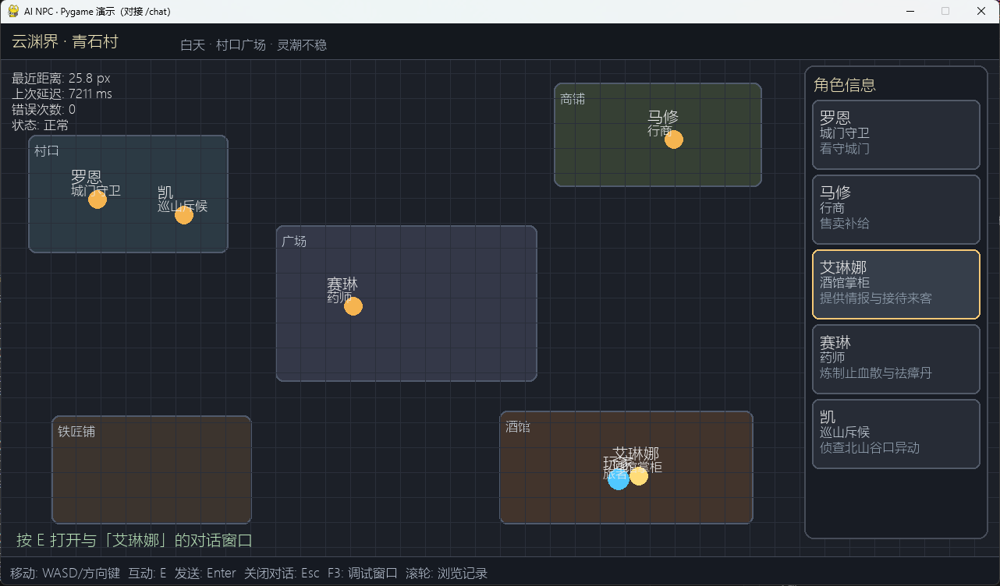
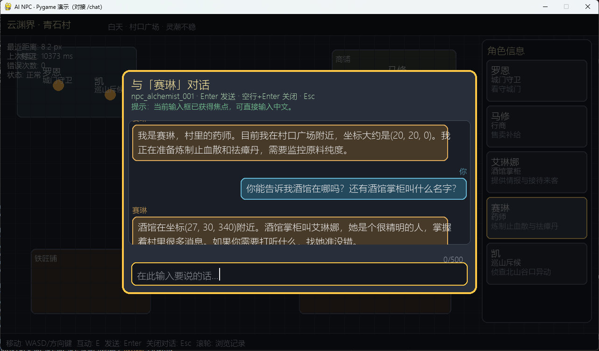
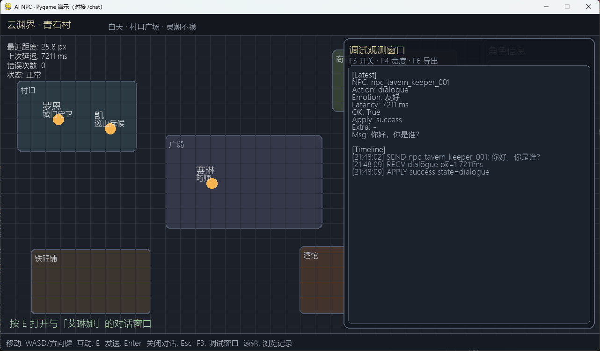
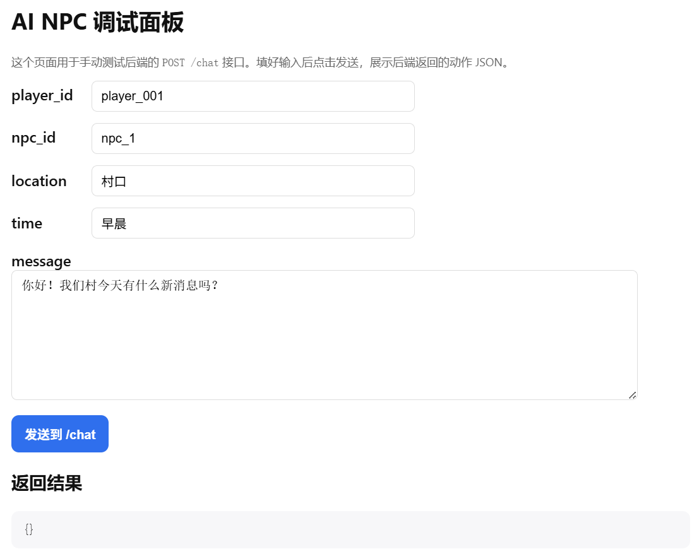

# AI NPC 后端

为游戏中的 NPC 提供具备**长期记忆、世界观感知、知识图谱检索与结构化动作决策**的 AI 后端。使用 **LangGraph 编排**串联：RAG(ChromaDB) + KG(Neo4j) -> Prompt -> LLM Function Calling -> 短期记忆同步更新，并在响应后异步沉淀长期记忆，与游戏引擎通过 HTTP JSON 对接。

## 项目是做什么的

- 这是一个面向游戏的 **NPC 决策服务**（后端 API），不是完整游戏客户端。
- 游戏侧通过 `POST /chat` 发送玩家输入和场景信息，本服务返回结构化动作（`dialogue/move/emote/use_item/idle`）。
- 服务内部会做 RAG 检索（世界观 + 分级交互记忆）、KG 检索（实体关系事实）、工具调用（本地工具 + MCP 工具）和记忆沉淀。

## 快速启动

```bash
python -m venv .venv
.venv\Scripts\activate   # Windows
pip install -r requirements.txt
python run.py
```

启动后访问 `http://localhost:5000/health` 验证服务状态。

## 模拟游戏 Demo（Pygame）

- 仓库内包含一个可直接联调本后端的模拟游戏子项目：`AI-NPC-demo-pygame`。
- 该子项目用于快速验证“玩家输入 -> `/chat` -> NPC 对话/动作反馈”的最小闭环。
- 详细说明（运行步骤、交互方式、已知限制）请查看：`AI-NPC-demo-pygame/README.md`。





最简联调流程：

1. 在本项目根目录启动后端：`python run.py`
2. 进入子项目目录并启动 Demo：

```bash
cd AI-NPC-demo-pygame
pip install -r requirements.txt
python run.py
```

## 架构概览（LangGraph 主链路）

```
游戏客户端 (前端) ←—— HTTP POST /chat(JSON) ——→ AI 决策端(Flask，本服务)
                                             ↓
                                 LangGraph 图编排主流程
                   retrieve(RAG) -> retrieve_kg(Neo4j) -> get_short_term_history -> build_prompt -> prepare_tools -> agent <-> tools -> update_short_term
                                             ↓
                                    LLM(Function Calling)输出标准动作 JSON
                                             ↓
                          background task: classify dialogue tier -> write ChromaDB
```

- **Gateway**：`POST /chat` 接收 `player_id`、`message`、`scene_info`、可选 `npc_id`，返回动作 JSON。
- **RAG 检索**：ChromaDB(长期记忆) 按 metadata 分类检索四路片段（世界观 / 角色设定 / 重要对话 / 日常对话摘要）。
- **KG 检索**：在 `retrieve_kg` 节点执行。LLM 先把玩家问题解析为“实体 + Label + 关系意图”，再按 Label 到 Neo4j 检索该实体的关联子图（出入边），整理为 `kg_facts`（`head relation tail`）并注入 `【知识图谱事实（高优先级）】` 区块。
- **推理**：把召回片段拼入 system/user prompt，要求模型通过 `npc_action` 工具输出结构化动作。
- **写回沉淀**：短期记忆在主链路同步更新；长期记忆在返回响应后异步分级写回 ChromaDB（受 `use_consolidation` 控制）。

架构图：images/img0.png

## 记忆系统设计

系统采用“短期记忆 + 长期记忆”双层结构，并在长期 `dialogue` 里进一步做分级沉淀。

长期记忆基于 **ChromaDB 单集合 `memory`**，通过 metadata 分为三类：

- `memory_type=world`：世界观设定（全角色共享）
- `memory_type=persona`：角色设定（按 `npc_id` 隔离）
- `memory_type=dialogue`：角色与玩家历史（按 `npc_id + player_id` 隔离）

其中 `dialogue` 增加二级标签 `dialogue_tier`：

- `dialogue_tier=important`：重要记忆，完整保留原始对话语义（不改写）
- `dialogue_tier=daily`：日常记忆，先由 LLM 压缩总结后再入库

检索阶段会并行召回四路内容：`world`、`persona`、`dialogue_important`、`dialogue_daily`，再按分区拼入 prompt。  
`dialogue` 配额独立控制：`memory.k_dialogue_important=5`、`memory.k_dialogue_daily=3`（可按需要调整）。

存储时机区分如下：

- **短期记忆（内存）**：主链路内同步写入（先 user 后 assistant），确保下一轮立刻可见
- **长期记忆（Chroma）**：在返回前端响应后由后台异步任务写入，避免阻塞接口响应
- **长期写入门槛**：仍受 `use_consolidation` 与 `memory.dialogue_store_min_chars` 控制

## 知识图谱（KG）设计

系统引入 Neo4j 作为结构化知识层，和向量记忆并行检索：

- **离线构建（Phase1）**：LLM 从 `lore/world.md` 与 `lore/persona/*.md` 抽取实体/关系/Label 并写入 Neo4j
- **在线检索（Phase2）**：每轮在 `retrieve_kg` 节点用 LLM 解析问题（实体+Label+关系意图），再按 Label 检索邻接关系
- **Prompt 融合**：以 `【知识图谱事实（高优先级）】` 区块注入，模型被要求优先遵守图谱事实

相关脚本：

```bash
python scripts/kg_init_neo4j.py      # 初始化 Label 约束/索引（可重复执行，不删除数据）
python scripts/kg_build_from_lore.py # LLM 抽取 lore 的实体/关系并写入图谱
```

常用验证查询（Neo4j Browser）：

```cypher
MATCH (n) RETURN labels(n) AS labels, n.id AS id, n.name AS name LIMIT 50;
MATCH (a)-[r]->(b) RETURN labels(a) AS a_labels, a.name AS a_name, type(r) AS rel, labels(b) AS b_labels, b.name AS b_name LIMIT 100;
```

## 详细运行与配置

`快速启动` 一节已经包含最小运行命令；这里补充需要注意的配置项：

- 可先复制示例配置：`config.example.yaml` -> `config.yaml`。
- 确保项目根目录存在 `config.yaml`（字段结构来源于 `app/config.py` 的默认配置）。
- 在 `config.yaml` 中填写 `llm.api_key`，或设置环境变量 `AI_NPC_LLM_API_KEY`（环境变量优先生效）。
- **不要将包含真实 api_key 的 `config.yaml` 提交到仓库。**

服务默认监听 `http://0.0.0.0:5000`，可通过 `http://localhost:5000/health` 做健康检查。

## 接口说明

> 该项目对外提供的是 HTTP API。本地有一个测试的web页面。



### POST /chat

**请求体 (JSON)**


| 字段         | 类型     | 必填  | 说明           |
| ---------- | ------ | --- | ------------ |
| player_id  | string | 是   | 玩家唯一标识       |
| message    | string | 是   | 玩家当前对话内容     |
| scene_info | object | 否   | 场景信息（地点、时间等） |
| npc_id     | string | 否   | 当前对话的 NPC 标识（不传时使用默认角色上下文） |


**动作字段说明**


| 字段          | 类型     | 说明                                        |
| ----------- | ------ | ----------------------------------------- |
| action_type | string | dialogue / move / emote / use_item / idle |
| dialogue    | string | NPC 台词                                    |
| emotion     | string | 可选，情绪/表情                                  |
| target_id   | string | 可选，动作目标                                   |
| extra       | object | 可选，扩展                                     |


## 配置项


| 配置                              | 说明                                        |
| ------------------------------- | ----------------------------------------- |
| use_rag                         | 是否启用长期记忆检索                                |
| use_consolidation               | 是否将每轮对话沉淀到长期记忆                            |
| llm.*                           | 大模型 API 地址、模型名、temperature、超时等            |
| embeddings.*                    | 向量化模型（用于 RAG），默认 BGE 中文                   |
| vectorstore.*                   | ChromaDB 持久化目录与集合名                        |
| memory.short_term_turns         | 短期记忆保留轮数                                  |
| memory.k_world                  | 世界观检索召回条数                                 |
| memory.k_persona                | 角色设定检索召回条数                                |
| memory.k_dialogue_important     | 角色-玩家重要记忆检索召回条数                          |
| memory.k_dialogue_daily         | 角色-玩家日常摘要记忆检索召回条数                      |
| memory.dialogue_store_min_chars | 对话写回长期记忆的最小长度阈值                           |
| mcp.enabled                     | 是否启用 MCP 工具动态发现与调用                        |
| mcp.command                     | 启动 MCP 服务进程的命令（默认当前 python）               |
| mcp.args                        | 启动 MCP 服务参数（默认 `npc_mcp/local_server.py`） |
| knowledge_graph.enabled         | 是否启用知识图谱在线检索（Neo4j）                      |
| knowledge_graph.neo4j.*         | Neo4j 连接配置（uri/user/password/database）          |
| knowledge_graph.retrieval.*     | KG 检索参数（max_entities/max_facts/edge_limit）     |


## 世界观 (Lore) 导入

可将静态世界观文本写入统一 memory（`memory_type=world`）。你可以直接使用内置脚本把 `lore/*.md` 导入：

```bash
python scripts/import_lore.py
```

## 角色设定导入

每个 NPC 使用一个独立的 markdown 文件，路径为 `lore/persona/<npc_id>.md`。  
执行导入脚本后会按文件名识别 `npc_id`，并按内容哈希生成稳定 ID，重复执行会自动去重更新。

```bash
python scripts/import_persona.py
```

## 技术栈

- **Web**：Flask
- **编排**：LangGraph
- **LLM**：DeepSeek API（OpenAI 兼容）
- **向量库**：ChromaDB
- **嵌入**：sentence-transformers (BAAI/bge-small-zh-v1.5)

## 许可证

按项目约定。

## 项目目录与文件作用

### 根目录

- `config.yaml`：运行配置（LLM、嵌入模型、ChromaDB 持久化目录、RAG/沉淀相关参数等）。建议不要提交真实 `api_key`。
- `config.example.yaml`：可提交的配置模板（不含真实密钥），用于新环境快速复制生成 `config.yaml`。
- `requirements.txt`：Python 依赖列表。
- `run.py`：Flask 启动入口，启动 `app.main.create_app()`，监听 `0.0.0.0:5000`。
- `README.md`：项目说明。
- `.gitignore`：忽略虚拟环境、`config.yaml`、`data/`、`models/` 等不应提交的内容。

### `app/`

- `app/__init__.py`：包初始化文件（用于 Python 模块识别）。
- `app/config.py`：加载 `config.yaml`，并支持环境变量 `AI_NPC_LLM_API_KEY` 覆盖敏感的 LLM `api_key`。
- `app/langgraph_agent.py`：LangGraph 主链路编排实现（retrieve -> retrieve_kg -> get_short_term_history -> build_prompt -> prepare_tools -> agent <-> tools -> update_short_term），并提供长期记忆异步沉淀函数。
- `app/main.py`：Web Gateway 与路由实现。
  - `GET /health`：健康检查。
  - `POST /chat`：核心对话接口（接收状态 -> 组装 prompt -> 调用 LLM -> 输出动作 JSON -> 记忆更新与沉淀）。
- `app/schemas/`
  - `__init__.py`：导出请求/响应相关类型（便于外部模块直接导入）。
  - `request.py`：定义 `/chat` 请求体结构 `ChatRequest`。
  - `response.py`：定义后端返回动作结构 `ActionResponse`（`action_type`、`dialogue`、`emotion`、`target_id`、`extra`）。
- `app/memory/`
  - `__init__.py`：导出记忆模块。
  - `short_term.py`：短期记忆模块（按 `player_id+npc_id` 维护最近对话轮次）。
  - `long_term.py`：长期记忆与 RAG（ChromaDB 单集合 + metadata 分类，提供 `search_world/search_persona/search_dialogue_important/search_dialogue_daily` 与 `add_world/add_persona/add_dialogue`）。
- `app/integrations/`
  - `mcp_client.py`：MCP 客户端封装，使用 stdio 连接 `npc_mcp/local_server.py`，提供 `list_tools()` / `call_tool()`。
- `app/knowledge_graph/`
  - `schema.py`：KG Label/关系白名单与稳定实体 ID 规则（导入与检索共用）。
  - `client.py`：Neo4j 查询封装（按 Label 查实体与邻接关系）。
  - `retriever.py`：KG 检索编排（LLM 解析问题 -> Label 检索 -> 事实排序与格式化）。
- `app/reasoning/`（推理）
  - `__init__.py`：导出推理相关方法（prompt/llm 调用）。
  - `prompts.py`：把“场景信息 + RAG 召回内容 + 当前玩家消息”组装成发送给 LLM 的消息（system/user）。
  - `llm.py`：调用 DeepSeek（OpenAI 兼容接口）并使用 Function Calling 输出结构化动作。
- `app/tools/`（本地工具）
  - `location_tools.py`：本地地点解析工具，输入地点字符串返回预置坐标。
  - `npc_state_tools.py`：本地 NPC 状态工具（被本地工具链路或 MCP 工具共享）。
  - `__init__.py`：导出本地工具。

### `lore/`

- `world.md`：世界观示例文本。该目录下的 `.md` 会被 `scripts/import_lore.py` 导入到 ChromaDB 的 `lore` 集合。

### `app/templates/`

- `index.html`：`GET /` 的最简页面（仅用于调试，通常不参与 `/chat` 主链路）。

### `scripts/`

- `import_lore.py`：把 `lore/` 下的文本切片后写入统一 memory（`memory_type=world`）。
- `import_persona.py`：读取 `lore/persona/*.md`，按 `npc_id` 导入角色设定到统一 memory（`memory_type=persona`，支持去重）。
- `kg_reset_neo4j.py`：清空 Neo4j 当前数据库中的节点与关系（重建图谱时使用）。
- `kg_init_neo4j.py`：初始化 Neo4j Label 约束与索引（按各 Label 的 `id` 唯一、`name` 索引）。
- `kg_build_from_lore.py`：使用 LLM 从 `lore/` 抽取实体/关系/Label 并写入 Neo4j。

### `npc_mcp/`

- `local_server.py`：本地 MCP 服务，挂载 `get_npc_runtime_state(npc_id)` 工具。
- `README.md`：MCP 服务使用说明。

### 运行期生成/使用的目录

- `data/chroma/`：ChromaDB 持久化存储目录（由 `vectorstore.persist_dir` 决定）。
- `models/`：向量化模型缓存目录（由 `embeddings.cache_dir` 决定）。

## 启动后如何访问

`run.py` 启动时绑定 `0.0.0.0:5000`，所以：

- 在本机：访问 `http://localhost:5000/health`、`http://localhost:5000/chat`
- 在同局域网其它机器：访问 `http://<你的服务器IP>:5000/health`、`http://<你的服务器IP>:5000/chat`

注意：本项目核心能力是 API；另外提供 `GET /` 的最简调试页面（`app/templates/index.html`）。

## MCP 启动与联动

1. 启动 MCP 服务（新终端）：

```bash
python npc_mcp/local_server.py
```

1. 启动 AI 后端（另一个终端）：

```bash
python run.py
```

1. 确保 `config.yaml` 中 `mcp.enabled: true`。

服务运行后，`/chat` 流程会在每轮对话中动态发现 MCP tools，并在模型产生对应 `tool_call` 时自动调用；你不需要手工调接口。


本人26年应届生正在找工作，如有老板愿意给个机会，欢迎联系xudarenzx@163.com