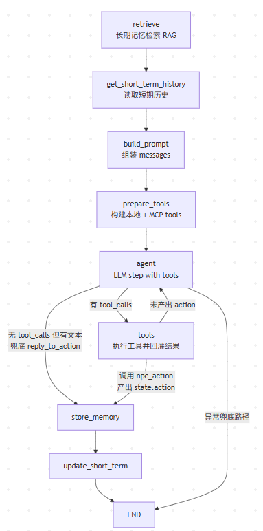

# AI NPC 后端

为游戏中的 NPC 提供具备**长期记忆、世界观感知与结构化动作决策**的 AI 后端。使用 **LangGraph 编排**串联：RAG(ChromaDB) -> Prompt -> LLM Function Calling -> 写回 ChromaDB，与游戏引擎通过 HTTP JSON 对接。

## 项目是做什么的

- 这是一个面向游戏的 **NPC 决策服务**（后端 API），不是完整游戏客户端。
- 游戏侧通过 `POST /chat` 发送玩家输入和场景信息，本服务返回结构化动作（`dialogue/move/emote/use_item/idle`）。
- 服务内部会做 RAG 检索（世界观 + 交互记忆）、工具调用（本地工具 + MCP 工具）和记忆写回。

## 快速启动

```bash
python -m venv .venv
.venv\Scripts\activate   # Windows
pip install -r requirements.txt
python run.py
```

启动后访问 `http://localhost:5000/health` 验证服务状态。

## 模拟游戏 Demo（Pygame）

- 仓库内包含一个可直接联调本后端的模拟游戏子项目：`AI-NPC-demo-pygame`。
- 该子项目用于快速验证“玩家输入 -> `/chat` -> NPC 对话/动作反馈”的最小闭环。
- 详细说明（运行步骤、交互方式、已知限制）请查看：`AI-NPC-demo-pygame/README.md`。


最简联调流程：

1. 在本项目根目录启动后端：`python run.py`
2. 进入子项目目录并启动 Demo：

```bash
cd AI-NPC-demo-pygame
pip install -r requirements.txt
python run.py
```

## 架构概览（LangGraph 主链路）

```
游戏客户端 (前端) ←—— HTTP POST /chat(JSON) ——→ AI 决策端(Flask，本服务)
                                             ↓
                                 LangGraph 图编排主流程
                   retrieve(RAG) -> get_short_term_history -> build_prompt -> prepare_tools -> agent <-> tools -> store_memory -> update_short_term
                                             ↓
                                    LLM(Function Calling)输出标准动作 JSON
```

- **Gateway**：`POST /chat` 接收 `player_id`、`message`、`scene_info`、可选 `npc_id`，返回动作 JSON。
- **RAG 检索**：ChromaDB(长期记忆) 按 metadata 分类检索三类片段（世界观 / 角色设定 / 角色-玩家历史）。
- **推理**：把召回片段拼入 system/user prompt，要求模型通过 `npc_action` 工具输出结构化动作。
- **写回沉淀**：根据 `use_consolidation` 配置，把本轮交互写回 ChromaDB（供后续 RAG 检索）。



## 记忆系统设计

长期记忆基于 **ChromaDB 单集合 `memory`**，通过 metadata 分为三类：

- `memory_type=world`：世界观设定（全角色共享）
- `memory_type=persona`：角色设定（按 `npc_id` 隔离）
- `memory_type=dialogue`：角色与玩家历史（按 `npc_id + player_id` 隔离）

每轮对话检索固定三段（world/persona/dialogue）并拼入 prompt；短期记忆仍在内存中按 `player_id+npc_id` 维护。  
写回阶段仅沉淀 `dialogue`（受 `use_consolidation` 与 `memory.dialogue_store_min_chars` 控制）。

## 详细运行与配置

`快速启动` 一节已经包含最小运行命令；这里补充需要注意的配置项：

- 可先复制示例配置：`config.example.yaml` -> `config.yaml`。
- 确保项目根目录存在 `config.yaml`（字段结构来源于 `app/config.py` 的默认配置）。
- 在 `config.yaml` 中填写 `llm.api_key`，或设置环境变量 `AI_NPC_LLM_API_KEY`（环境变量优先生效）。
- **不要将包含真实 api_key 的 `config.yaml` 提交到仓库。**

服务默认监听 `http://0.0.0.0:5000`，可通过 `http://localhost:5000/health` 做健康检查。

## 接口说明

> 该项目对外提供的是 HTTP API。本地有一个测试的web页面。


### POST /chat

**请求体 (JSON)**


| 字段         | 类型     | 必填  | 说明           |
| ---------- | ------ | --- | ------------ |
| player_id  | string | 是   | 玩家唯一标识       |
| message    | string | 是   | 玩家当前对话内容     |
| scene_info | object | 否   | 场景信息（地点、时间等） |
| npc_id     | string | 是   | 当前对话的 NPC 标识 |


**动作字段说明**


| 字段          | 类型     | 说明                                        |
| ----------- | ------ | ----------------------------------------- |
| action_type | string | dialogue / move / emote / use_item / idle |
| dialogue    | string | NPC 台词                                    |
| emotion     | string | 可选，情绪/表情                                  |
| target_id   | string | 可选，动作目标                                   |
| extra       | object | 可选，扩展                                     |


## 配置项


| 配置                              | 说明                                        |
| ------------------------------- | ----------------------------------------- |
| use_rag                         | 是否启用长期记忆检索                                |
| use_consolidation               | 是否将每轮对话沉淀到长期记忆                            |
| llm.*                           | 大模型 API 地址、模型名、temperature、超时等            |
| embeddings.*                    | 向量化模型（用于 RAG），默认 BGE 中文                   |
| vectorstore.*                   | ChromaDB 持久化目录与集合名                        |
| memory.short_term_turns         | 短期记忆保留轮数                                  |
| memory.k_world                  | 世界观检索召回条数                                 |
| memory.k_persona                | 角色设定检索召回条数                                |
| memory.k_dialogue               | 角色-玩家历史检索召回条数                             |
| memory.dialogue_store_min_chars | 对话写回长期记忆的最小长度阈值                           |
| mcp.enabled                     | 是否启用 MCP 工具动态发现与调用                        |
| mcp.command                     | 启动 MCP 服务进程的命令（默认当前 python）               |
| mcp.args                        | 启动 MCP 服务参数（默认 `npc_mcp/local_server.py`） |


## 世界观 (Lore) 导入

可将静态世界观文本写入统一 memory（`memory_type=world`）。你可以直接使用内置脚本把 `lore/*.md` 导入：

```bash
python scripts/import_lore.py
```

## 角色设定导入

每个 NPC 使用一个独立的 markdown 文件，路径为 `lore/persona/<npc_id>.md`。  
执行导入脚本后会按文件名识别 `npc_id`，并按内容哈希生成稳定 ID，重复执行会自动去重更新。

```bash
python scripts/import_persona.py
```

## 技术栈

- **Web**：Flask
- **编排**：LangGraph
- **LLM**：DeepSeek API（OpenAI 兼容）
- **向量库**：ChromaDB
- **嵌入**：sentence-transformers (BAAI/bge-small-zh-v1.5)

## 许可证

按项目约定。

## 项目目录与文件作用

### 根目录

- `config.yaml`：运行配置（LLM、嵌入模型、ChromaDB 持久化目录、RAG/沉淀相关参数等）。建议不要提交真实 `api_key`。
- `config.example.yaml`：可提交的配置模板（不含真实密钥），用于新环境快速复制生成 `config.yaml`。
- `requirements.txt`：Python 依赖列表。
- `run.py`：Flask 启动入口，启动 `app.main.create_app()`，监听 `0.0.0.0:5000`。
- `README.md`：项目说明。
- `.gitignore`：忽略虚拟环境、`config.yaml`、`data/`、`models/` 等不应提交的内容。

### `app/`

- `app/__init__.py`：包初始化文件（用于 Python 模块识别）。
- `app/config.py`：加载 `config.yaml`，并支持环境变量 `AI_NPC_LLM_API_KEY` 覆盖敏感的 LLM `api_key`。
- `app/langgraph_agent.py`：LangGraph 主链路编排实现（retrieve -> build_prompt -> run_llm -> store_memory）。
- `app/langgraph_agent.py`：LangGraph 主链路编排实现（retrieve -> get_short_term_history -> build_prompt -> prepare_tools -> agent <-> tools -> store_memory -> update_short_term）。
- `app/main.py`：Web Gateway 与路由实现。
  - `GET /health`：健康检查。
  - `POST /chat`：核心对话接口（接收状态 -> 组装 prompt -> 调用 LLM -> 输出动作 JSON -> 记忆更新与沉淀）。
- `app/schemas/`
  - `__init__.py`：导出请求/响应相关类型（便于外部模块直接导入）。
  - `request.py`：定义 `/chat` 请求体结构 `ChatRequest`。
  - `response.py`：定义后端返回动作结构 `ActionResponse`（`action_type`、`dialogue`、`emotion`、`target_id`、`extra`）。
- `app/memory/`
  - `__init__.py`：导出记忆模块。
  - `short_term.py`：短期记忆模块（按 `player_id+npc_id` 维护最近对话轮次）。
  - `long_term.py`：长期记忆与 RAG（ChromaDB 单集合 + metadata 分类，提供 `search_world/search_persona/search_dialogue` 与 `add_world/add_persona/add_dialogue`）。
- `app/integrations/`
  - `mcp_client.py`：MCP 客户端封装，使用 stdio 连接 `npc_mcp/local_server.py`，提供 `list_tools()` / `call_tool()`。
- `app/reasoning/`（推理）
  - `__init__.py`：导出推理相关方法（prompt/llm 调用）。
  - `prompts.py`：把“场景信息 + RAG 召回内容 + 当前玩家消息”组装成发送给 LLM 的消息（system/user）。
  - `llm.py`：调用 DeepSeek（OpenAI 兼容接口）并使用 Function Calling 输出结构化动作。
- `app/tools/`（本地工具）
  - `location_tools.py`：本地地点解析工具，输入地点字符串返回预置坐标。
  - `npc_state_tools.py`：本地 NPC 状态工具（被本地工具链路或 MCP 工具共享）。
  - `__init__.py`：导出本地工具。

### `lore/`

- `world.md`：世界观示例文本。该目录下的 `.md` 会被 `scripts/import_lore.py` 导入到 ChromaDB 的 `lore` 集合。

### `app/templates/`

- `index.html`：`GET /` 的最简页面（仅用于调试，通常不参与 `/chat` 主链路）。

### `scripts/`

- `import_lore.py`：把 `lore/` 下的文本切片后写入统一 memory（`memory_type=world`）。
- `import_persona.py`：读取 `lore/persona/*.md`，按 `npc_id` 导入角色设定到统一 memory（`memory_type=persona`，支持去重）。

### `npc_mcp/`

- `local_server.py`：本地 MCP 服务，挂载 `get_npc_runtime_state(npc_id)` 工具。
- `README.md`：MCP 服务使用说明。

### 运行期生成/使用的目录

- `data/chroma/`：ChromaDB 持久化存储目录（由 `vectorstore.persist_dir` 决定）。
- `models/`：向量化模型缓存目录（由 `embeddings.cache_dir` 决定）。

## 启动后如何访问

`run.py` 启动时绑定 `0.0.0.0:5000`，所以：

- 在本机：访问 `http://localhost:5000/health`、`http://localhost:5000/chat`
- 在同局域网其它机器：访问 `http://<你的服务器IP>:5000/health`、`http://<你的服务器IP>:5000/chat`

注意：这里没有 UI 页面，只有 API 接口（游戏客户端/引擎需要直接调用这些 HTTP 地址）。

## MCP 启动与联动

1. 启动 MCP 服务（新终端）：

```bash
python npc_mcp/local_server.py
```

1. 启动 AI 后端（另一个终端）：

```bash
python run.py
```

1. 确保 `config.yaml` 中 `mcp.enabled: true`。

服务运行后，`/chat` 流程会在每轮对话中动态发现 MCP tools，并在模型产生对应 `tool_call` 时自动调用；你不需要手工调接口。

## 一次 /chat 请求的执行链路

1. 前端（游戏客户端）向后端发送 `POST /chat`，JSON 输入：`player_id`、`message`、可选 `scene_info`、可选 `npc_id`。
2. `app/main.py` 的 `/chat` 路由处理函数读取 JSON 并构建 `ChatRequest`。
3. 路由函数调用 `agent_graph.invoke(...)`（`app/langgraph_agent.py` 中的 LangGraph 图编排）并把输入放进图的 `state`；同时传入 `recursion_limit` 用于防止无限循环。
4. LangGraph 节点 `retrieve`：调用 `LongTermMemory.search_world/search_persona/search_dialogue()`（内部使用 sentence-transformers + ChromaDB）
  - 输入：`player_id / npc_id / message / scene_info`  
  - 输出：
    - `state.world_chunks: list[str]`（全局世界观，所有角色共享）
    - `state.persona_chunks: list[str]`（当前 NPC 的角色设定）
    - `state.dialogue_chunks: list[str]`（当前 NPC 与玩家的长期互动记忆）
5. LangGraph 节点 `get_short_term_history`：调用 `ShortTermMemory.get_recent()`
  - 输入：`player_id / npc_id`  
  - 输出：`state.short_term_history: list[{"role","content"}]`
6. LangGraph 节点 `build_prompt`：调用 `build_messages()` 组装给 LLM 的 `messages`
  - 输入：`message / npc_id / scene_info / short_term_history / world_chunks / persona_chunks / dialogue_chunks`  
  - 输出：`state.messages`
7. LangGraph 节点 `prepare_tools`：构建本轮可用 tools schema（包含 `npc_action`、本地 `resolve_location_coordinates`、以及通过 MCP 动态发现的工具）。
  - 重要：`get_npc_runtime_state` **只允许通过 MCP 调用**（不会回退到本地共享函数）。
  - 工具描述已增强：明确了“何时调用本地坐标工具 / 何时调用 MCP 状态工具 / 何时必须输出 npc_action”，降低模型漏调工具概率。
8. LangGraph 进入循环：`agent <-> tools`（由图的条件边决定是否继续调用工具）。
  - `agent`：单步调用 LLM（`llm_step_with_tools()`），拿到 `tool_calls` 或最终内容  
  - `tools`：执行工具并把结果以 `role=tool` 追加回 `state.messages`；同时对工具返回值附带“结果解释模板”（`RAW_RESULT_JSON` + `RESULT_EXPLANATION_TEMPLATE`），降低模型误读工具返回值的概率  
  - 当模型产生 `npc_action` tool_call 时：解析为 `state.action: ActionResponse` 并结束循环  
  - 防死循环：由 LangGraph 的 `recursion_limit` 控制最大回合数（而不是在 `llm.py` 写死 4 次）
9. LangGraph 节点 `store_memory`：当 `use_consolidation=true` 时调用 `LongTermMemory.add_dialogue()` 把本轮交互写回 ChromaDB（`memory_type=dialogue`）。
  - 输出：ChromaDB 落盘（`state.action` 不变）
10. LangGraph 节点 `update_short_term`：写入短期记忆（先 user 再 assistant），用于下一轮 prompt。
11. 返回 `ActionResponse` 的 JSON 给游戏客户端，游戏引擎据此执行对话/动作表现。

## 全链路调用示例（从前端到输出）

1. 前端调用接口：`POST http://localhost:5000/chat`
2. 请求体（JSON）：

```json
{
  "player_id": "player_001",
  "message": "你好，你叫什么名字？",
  "scene_info": { "location": "村口", "time": "早晨" },
  "npc_id": "npc_guard_001"
}
```

1. 后端处理与调用函数链路（一次请求的关键路径）：
  1. `app/main.py` `/chat`：读取 JSON -> 调用 `agent_graph.invoke()`
  2. `app/langgraph_agent.py`：`retrieve(LongTermMemory.search)` -> `get_short_term_history(ShortTermMemory.get_recent)` -> `build_prompt(build_messages)` -> `prepare_tools(build_tooling)` -> `agent(llm_step_with_tools) <-> tools(run_tool_call)` -> `store_memory(LongTermMemory.add_documents)` -> `update_short_term(ShortTermMemory.add_turn)`
  3. `app/reasoning/llm.py`：提供单步 LLM 调用与工具执行函数；循环/决策由 LangGraph 条件边控制
2. 响应体（200，JSON，示例）：

```json
{
  "action_type": "dialogue",
  "dialogue": "我是城门守卫罗恩。请出示你的通行证或说明来意。",
  "emotion": "严肃",
  "extra": {
    "job": "守卫",
    "location": {
      "x": 5,
      "y": 5,
      "z": 0
    },
    "task": "看守城门"
  }
}
```

## 全链路调用示例（同时调用本地 tool + MCP tool）

下面示例展示：模型在同一个步骤里同时触发 **本地工具** `resolve_location_coordinates` 和 **MCP 工具** `get_npc_runtime_state`，并最终输出 `npc_action`。

### 前提

- `config.yaml` 中 `mcp.enabled: true`
- MCP 服务已启动（例如在另一个终端运行）：
  - `python npc_mcp/local_server.py`

### 1. 前端请求

`POST http://localhost:5000/chat`

请求体（JSON）示例（该输入会在同一轮触发本地 tool + MCP tool）：

```json
{
  "player_id": "player_001",
  "message": "你好！告诉我你当前的运行状态，你的坐标，你能做哪些任务，顺便告诉我酒馆的具体坐标在哪？",
  "scene_info": { "location": "村口", "time": "早晨" },
  "npc_id": "npc_merchant_001"
}
```

### 2. 后端/图内调用链路（关键路径 + 输入输出）

1. `app/main.py` `/chat`：
  - 输入：上面的 JSON
  - 调用：`agent_graph.invoke(state=..., recursion_limit=20)`
2. LangGraph 依次跑节点：
  - `retrieve`：`LongTermMemory.search_world/search_persona/search_dialogue()`  
    - 输出：
      - `state.world_chunks: list[str]`（全局世界观）
      - `state.persona_chunks: list[str]`（当前 NPC 角色设定）
      - `state.dialogue_chunks: list[str]`（当前 NPC 与玩家历史）
  - `get_short_term_history`：`ShortTermMemory.get_recent()`  
    - 输出：`state.short_term_history: list[{"role","content"}]`
  - `build_prompt`：`build_messages(...)`  
    - 输入：`state.short_term_history / state.world_chunks / state.persona_chunks / state.dialogue_chunks / state.message...`
    - 输出：`state.messages`
  - `prepare_tools`：`build_tooling()`  
    - 输出：`state.tool_defs`（包含本地工具 schema + MCP 动态工具 schema）
  - `agent`：单步 LLM（`llm_step_with_tools(messages, tool_defs)`）
    - 输出：模型返回一个 assistant message，里面的 `tool_calls` 同时包含：
      - `resolve_location_coordinates({"place_name":"酒馆"})`（本地工具）
      - `get_npc_runtime_state({"npc_id":"npc_merchant_001"})`（MCP 工具）
      - `npc_action({...})`（格式指定工具）
3. 图进入 `tools` 节点（执行工具并把结果追加回 `state.messages`）：
  - 本地工具：`resolve_location_coordinates`  
    - 输出（示例）：`{"place_name":"酒馆","x":27,"y":30,"z":0}`
  - MCP 工具：`get_npc_runtime_state`  
    - 实际调用：`MCPToolClient.call_tool()` -> stdio 访问 `npc_mcp/local_server.py`
    - 输出（示例）：`{"npc_id":"npc_merchant_001","location":{...},"job":"商人","task":"售卖补给","available_actions":[...] }`
  - `npc_action`：在 `tools` 节点里解析其 `arguments`，直接写入：
    - `state.action: ActionResponse`
4. 条件路由决定下一步：
  - 由于已存在 `state.action`，路由进入 `store_memory` 并结束循环
5. `store_memory`（可选）：
  - 行为：`LongTermMemory.add_dialogue()` 写回 ChromaDB（当 `use_consolidation=true`）
6. `update_short_term`：
  - 写入短期记忆：先 user 再 assistant

### 3. 响应体（200，JSON，示例）

```json
{
  "action_type": "dialogue",
  "dialogue": "我是马修，一名行商。我当前的坐标是(42, 18, 0)，职业是商人，正在执行售卖补给的任务。我可以和你对话、移动位置、使用物品或者待机。至于酒馆的具体位置，它在坐标(27, 30, 340)处。",
  "emotion": "友好",
  "extra": {
    "my_available_actions": [
      "dialogue",
      "move",
      "use_item",
      "idle"
    ],
    "my_job": "商人",
    "my_location": {
      "x": 42,
      "y": 18,
      "z": 0
    },
    "my_task": "售卖补给",
    "tavern_location": {
      "x": 27,
      "y": 30,
      "z": 340
    }
  }
}
```

本人26年应届生正在找工作，如有老板愿意给个机会，欢迎联系xudarenzx@163.com